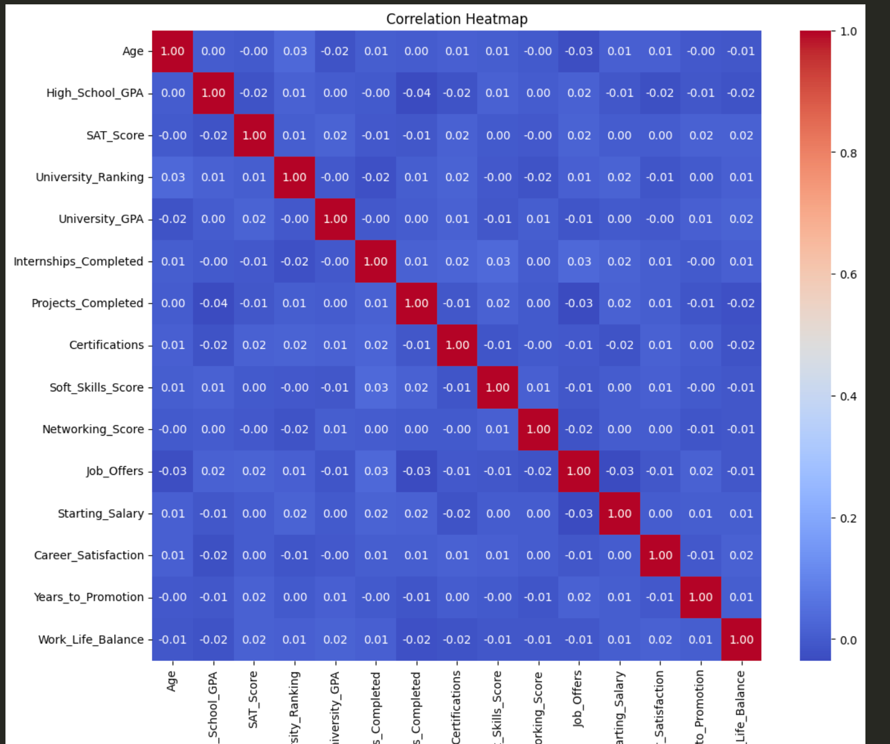

# Data-Analytics-Capstone-Project
# Machine Learning: Predicting Student Outcomes

This project aims to predict early career success metrics—**Starting Salary** and **Number of Job Offers**—for recent graduates using supervised machine learning techniques. Leveraging a dataset of academic performance, demographic attributes, and career outcomes, we develop and evaluate predictive models to uncover key factors influencing student success after graduation.

---

## Project Objectives

- Predict **Starting Salary** and **Job Offers** using student data  
- Identify important features that impact early career outcomes  
- Evaluate and compare model performance (e.g., Random Forest Regressor)  
- Provide actionable insights for educators, students, and career advisors  

---

## Methods & Tools

**Languages & Libraries:**  
Python, Pandas, NumPy, Matplotlib, Seaborn, Scikit-learn

**Modeling Techniques:**  
- Random Forest Regressor  
- Train-test split  
- Feature encoding & scaling  
- Performance metrics: RMSE, R²

**Key Techniques:**  
- Exploratory Data Analysis (EDA)  
- Feature engineering  
- Model training and evaluation  
- Visualizations for insights

---

## Dataset

The dataset contains demographic, academic, and career information for recent graduates. It includes features such as:

- Age, Gender, Major, GPA  
- Extracurricular involvement  
- Internship experience  
- Final starting salary and number of job offers  

>  *Note: For privacy reasons, the dataset used in this project may be anonymized or synthetically generated.*


---

## Key Visualizations & Diagrams
1. Exploratory Data Analysis (EDA)  





---

## Results Summary

- **Random Forest Regressors** were effective in modeling both salary and job offer predictions.
- Key features impacting success included:
  - GPA  
  - Internship Experience  
  - Major and University Tier  
  - Communication and Leadership Ratings
- The model showed strong predictive performance with R² values exceeding 0.80 in some cases.

---


## Repository Structure

```bash
.
├── analysis_code/                  # Jupyter Notebooks and model scripts
    ├── data_cleaning.ipynb
    ├── eda.ipynb
    ├── ml_analysis.ipynb
├── data/
│   ├── education_career_success_csv.csv     # Cleaned dataset
│   └── raw_education_career_success.csv     # Original data
├── images/                        # Plots and visualizations (optional)
├── README.md                      # This file
├── requirements.txt               # Python dependencies
├── LICENSE                        # MIT License
└── .gitignore                     # Files to exclude from version control
```

# Project Setup Guide

This guide provides instructions to set up and manage the Python virtual environment for this project.

---

## Prerequisites

- Python 3.8 or higher installed  
- (Optional but recommended) [pipx](https://pypa.github.io/pipx/) or a tool like [pyenv](https://github.com/pyenv/pyenv)

---

## Setting Up the Virtual Environment

### 1. Create a Virtual Environment

```bash
# Create the virtual environment in a folder named 'venv'
python -m venv venv
```

### 2. Activate the Virtual Environment
On Windows
``` bash
Copy
Edit
# Activate from Command Prompt
venv\Scripts\activate

# Or from PowerShell
.\venv\Scripts\Activate.ps1
```
On macOS / Linux
``` bash
Copy
Edit
source venv/bin/activate
```
### 3. Installing Project Dependencies
After activating the environment:

``` bash
Copy
Edit
# Install required packages
pip install -r requirements.txt
```
```bash
Copy
Edit
pip freeze > requirements.txt
```
### 4. Deactivating the Virtual Environment
To exit the virtual environment when you're done:

```bash
Copy
Edit
deactivate
```